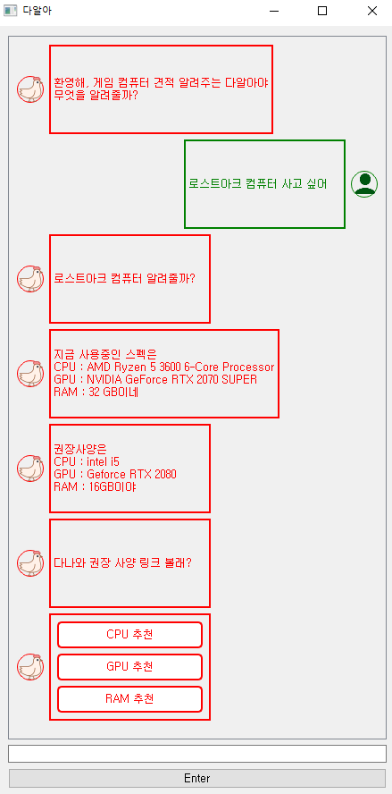

# 대구AI스쿨 챗봇 프로젝트

### 팀 : 매콤찜닭 스카이넷

구성원 : 김동영 장창대 조유경 김성진

# 개요
사용자의 발화에서 컴퓨터 사용 목적을 캐치하고,

해당 사용 목적에 맞는 컴퓨터 사양 업그레이드 및 구매 견적을

추천하여 링크를 제공하는 챗봇 개발

# 요구사양
konlpy를 사용하기 위하여 jdk를 설치하고 환경 변수를 설정해야한다

openjdk 설치 : https://openjdk.java.net/install/

환경변수 설정법 : https://blog.naver.com/PostView.nhn?blogId=alcmskfl17&logNo=221870079271

pip install로 설치할 수 없는 JPype는 installData 폴더에 설치용 .whl 파일이 들어있다
특이사항으로 호환성 문제가 있어 jpype의 버전을 최신 버전이 아니라 <=1.2 버전을 사용해야한다

예를 들어 자신의 파이썬 버전이 3.8이라면 cp38 파일을 설치하면 된다

윈도우 64bit 외의 경우에는 아래 링크에서 직접 다운로드하도록 하고

Jpype : https://www.lfd.uci.edu/~gohlke/pythonlibs/#jpype

  pip install <.whl파일 경로>
와 같은 명령어를 사용하여 설치한다

    pip install -r requirements.txt

# 샘플 이미지

